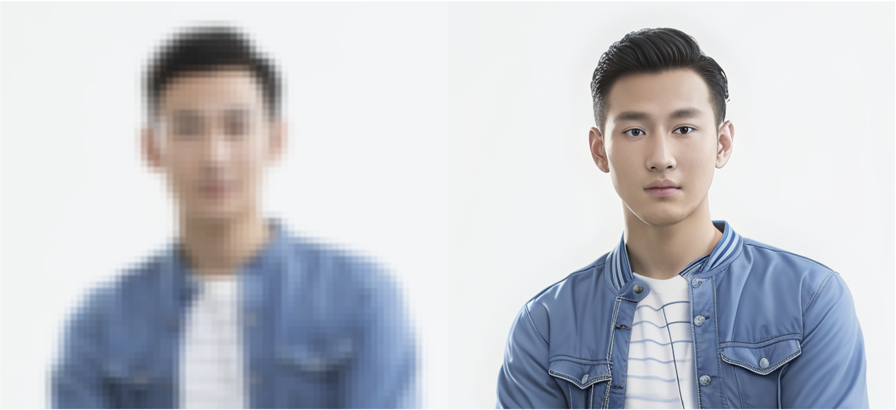
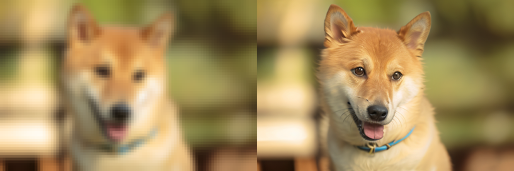

# Phantom
DreaMoving-Phantom is a general and automatic image enhancement and super-resolution framework, which can be applied to images of various scenes and qualities. With the demo we provide, users just need to upload a low-quality image to generate an enhanced image with one click. **No need to choose the sr model or adjust parameters**. Now you can try our demo at [modelscope](https://www.modelscope.cn/studios/vigen/DreaMoving_Phantom/summary) or [huggingface](https://huggingface.co/spaces/fangxia/Dreamoving-Phantom).

The quality of enhancement and functions of this project are being continuously optimized and expanded. We also welcome developers to continue to develop and contribute to this Repo.

## Examples
<p align="center" style="font-size: 16px; font-weight: bold;">input (left) and output (right)</p>

<p align="center">





</p>

## News
[2024.01.12] First release code  
[2024.01.19] Add text super-resolution module (improved from [MARCONet](https://github.com/csxmli2016/MARCONet)). This module will still be updated iteratively

## ⏰TODOs
- [✅] Add text super-resolution module to improve the effect of text scenes
- [ ] Release a model specifically for AIGC image enhancement
- [ ] Release a model specifically for old photo enhancement

## Installation
Now we suggest using the image provided by modelscope, simply run the following code:
```bash
# docker pull  
docker pull registry.cn-hangzhou.aliyuncs.com/modelscope-repo/modelscope:ubuntu20.04-cuda11.8.0-py38-torch2.0.1-tf2.13.0-1.9.3
```
run the docker and then:
```bash
git clone https://github.com/dreamoving/Phantom.git
# install python package
pip install -r requirements.txt
```
or you can install modelscope manually
```bash
git clone https://github.com/dreamoving/Phantom.git
pip install modelscope==1.9.3
pip install -r requirements.txt
```
Besides, you may need to download the following checkpoints before usage.  
Download [PASD](https://public-vigen-video.oss-cn-shanghai.aliyuncs.com/public/phantom/checkpoints/pasd.zip) and unzip it in runs/  
Download SD1.5 models from [huggingface](https://huggingface.co/runwayml/stable-diffusion-v1-5) and put them into checkpoints/stable-diffusion-v1-5  
Dwonload [RealESRGAN_x4plus](https://github.com/xinntao/Real-ESRGAN/releases/download/v0.1.0/RealESRGAN_x4plus.pth) and [RealESRGAN_x2plus](https://github.com/xinntao/Real-ESRGAN/releases/download/v0.2.1/RealESRGAN_x2plus.pth) and put them in realesrgan/weights  
Download [SwinIR](https://github.com/JingyunLiang/SwinIR/releases/download/v0.0/003_realSR_BSRGAN_DFOWMFC_s64w8_SwinIR-L_x4_GAN.pth) and put it in SwinIR/weights  
Download [iqa_model](https://public-vigen-video.oss-cn-shanghai.aliyuncs.com/public/phantom/checkpoints/mos_model_best.pth) and put it in synthesis_vqa/weights  
Download text_sr_model and put it in MARCONet/checkpoints, please refer to MARCONet/checkpoints/download_github.py  
Download [cnstd](https://huggingface.co/breezedeus/cnstd-cnocr-models) and put it in MARCONet/checkpoints/db_resnet34/1.2/db_resnet34  
When inferencing with PASD, you can use personalized_models instead of SD1.5. Download the [majicMIX](https://civitai.com/models/43331/majicmix-realistic) and put it in checkpoints/personalized_models to run the demo.

## Usage
As mentioned in the introduction, this is a fully automatic image enhancement super-resolution framework. Generally, you don’t need to select a model or adjust parameters based on image input. Simply run the following code, you can build a gradio demo locally. You can also try our online demo at [modelscope](https://www.modelscope.cn/studios/vigen/DreaMoving_Phantom/summary).
```bash
cd Phantom
# python gradio1.py
python gradio2.py # gradio2 is for the newest version, which includes text super-resolution module 
```

## Reference and Acknowledgments
We gratefully acknowledge the following projects and contributors for their work, which has greatly contributed to this program.  
[PASD](https://github.com/yangxy/PASD)  
[SwinIR](https://github.com/JingyunLiang/SwinIR)  
[Real-ESRGAN](https://github.com/xinntao/Real-ESRGAN)  
[MARCONet](https://github.com/csxmli2016/MARCONet)  
[CLIP](https://github.com/openai/CLIP)  
[LAVIS](https://github.com/salesforce/LAVIS)
