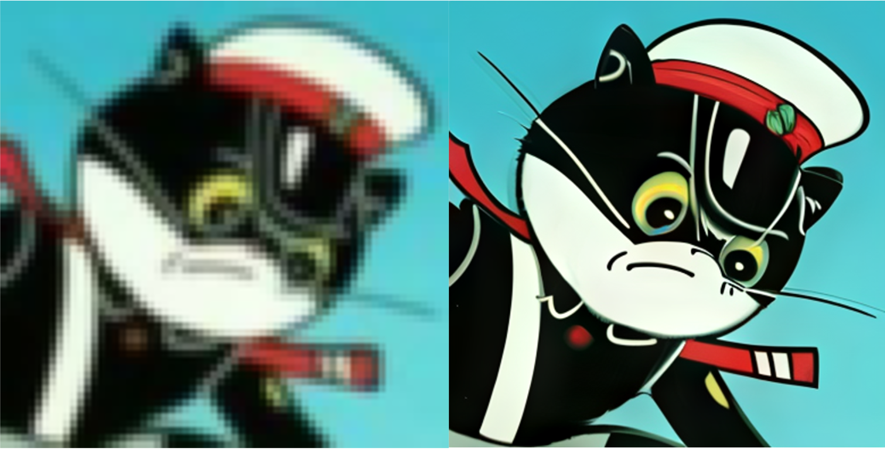

# dreamoving-phantom-project
DreaMoving-Phantom is an automated image enhancement and super-resolution framework, which can be applied to images of various scenes and qualities. The code will be released soon. Now you can try our [demo](https://www.modelscope.cn/studios/vigen/DreaMoving_Phantom/summary) at modelscope.

# Examples

